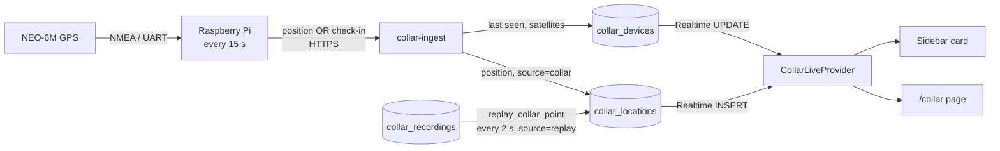

# Showcase — the GPS collar and Smart-ID, front and center

**Date:** 2026-09-26 · **Status:** approved by Lukas in brainstorming, spec awaiting his review
**Why now:** these two are what Lukas shows and defends at his bachelor's thesis defence. Lukas:
"make the collar stuff pop out in the sidebar, it is the one thing I've got going on to show and
defend for myself what I've done, it has to be front and center, just like the demo Smart-ID
stuff, I need to make it look real and what the process would look like."

**Mockups (approved):** `2026-09-26-showcase-mockups/` — `sidebar.html` (option A chosen),
`collar-page.html`, `smart-id.html`. Open them in a browser; the map in them is drawn, the app keeps
OpenStreetMap tiles.

## Decisions (Lukas, 2026-09-26)

1. **Collar data at the defence: both.** The real Raspberry Pi uplinks live when present;
   otherwise one click plays a recorded walk through the database like live data, so the map is
   never empty.
2. **Collar page = owner flow.** Consumer pairing (switch on → code from the sticker → who wears
   it → live check-in), a big live map, clear failure states. **No "How it works" diagram** —
   Lukas: "no need to explain how the collar works with that step by step diagram".
3. **Smart-ID = a real-looking form + a simulated phone.** Country + personal code (SK's test
   people one tap away) instead of the identity list; a phone mockup plays the Smart-ID app in
   step with SK's real session. The technical "How it works" box goes too.
4. **Sidebar option A, "live cards":** a live mini-map card for the collar and a Smart-ID status
   card at the top of the rail, on desktop and in the phone drawer.
5. **Phones too:** every screen has a 390 px version.
6. **Approach A for the recorded walk:** the database replays it, paced by the page (not the Pi,
   not a browser-only animation), so it works even when the Pi is dead or missing.
7. Recorded as the approved flow for later refactors (memory `showcase-flows`): a change that
   alters a state, threshold, step or honesty marker needs Lukas's say-so first.

Out of scope: real (paid) Smart-ID, Bluetooth pairing from the browser, battery telemetry, QR-code
pairing, alerts/geofences, pets linked to collars in the database, the Pi replaying walks itself.

## Facts this rests on (checked 2026-09-26)

- `collar_devices(id, owner_id NOT NULL, device_secret_hash, label, created_at)`; RLS: one
  `for all` policy `owner_id = auth.uid()`. `collar_locations(id, device_id, lat, lng, speed_kmh,
  battery_pct, recorded_at, created_at)`; owners `select`, inserts only by the service role.
  **Prod has 0 collars.**
- `register_collar_device(p_secret, p_label)` is `security invoker` and executable by `anon`.
  `verify_collar_device(p_device_id, p_secret)` is `security definer`, service role only, returns
  `owner_id`.
- Edge Function `collar-ingest` v5 is live (`verify_jwt` on; the Pi sends the anon key). Source:
  `iot-collar/supabase/functions/collar-ingest/`; `lib.test.ts` runs in vitest's `edge` project and
  pins today's validation gaps as bugs.
- Realtime publication `supabase_realtime` holds only `messages` and `notifications`.
- The Pi (`iot-collar/collar/`) reads GGA/RMC via pynmea2 every `FIX_INTERVAL_SECONDS` (15), and
  POSTs **only when it has a fix**. `GPSReader.read_fix()` returns the previous fix when no new one
  arrives, so after losing lock the Pi re-sends a stale position every tick. `Fix.satellites` is
  parsed but never sent. `read_battery_pct()` returns `None`. The offline queue (`queue.jsonl`)
  stores whole payloads, **including `device_secret`**, and is not in `.gitignore`.
- The web polls collars every 30 s (`CollarsPanel.tsx`, Profile → "My collars" tab). Pairing today:
  the site creates the device and shows `DEVICE_ID`/`DEVICE_SECRET` once for the Pi's `.env`.
- Smart-ID: `/smart-id-demo` → `SmartIdDemo.tsx` → `/api/smart-id-demo` (SK DEMO, RP API v3,
  notification flow, `displayTextAndPIN` "Prisijungimas prie PetBnB (demo)", 4-digit code). The API
  already accepts only `TEST_IDENTITIES` (5 LT people). The successful test person is
  `PNOLT-40404040009` → "OK TEST", issuer "TEST of SK ID Solutions EID-Q 2024E", QUALIFIED. The
  badge is saved by `request_/finish_smart_id_demo_verification` into `profiles.is_verified`,
  `verified_at`, `verification_method`, `smart_id_session_id`.
- CSP (`next.config.ts`): `img-src` allows `https://*.tile.openstreetmap.org`; `connect-src` is
  `'self'` + Supabase only.
- The `(app)` layout mounts `FavoritesProvider` and `NotificationsProvider` around `Sidebar`.

## How data moves



## Database (one migration)

**`collar_devices`**

```sql
alter table public.collar_devices
  alter column owner_id drop not null,
  add column pair_code      text unique check (pair_code ~ '^[0-9A-HJKMNP-TV-Z]{8}$'),
  add column claimed_at     timestamptz,
  add column is_demo        boolean not null default false,
  add column last_seen_at   timestamptz,
  add column gps_locked     boolean,
  add column gps_satellites smallint check (gps_satellites between 0 and 64);
```

- A collar is **registered** (row exists, `owner_id` null, `pair_code` set) before anyone owns it;
  **paired** = `owner_id` + `claimed_at` set. Demo collars: `is_demo`, no `pair_code`.
- `pair_code` is stored normalized: 8 Crockford base-32 characters (no I, L, O, U), shown as
  `XXXX-XXXX`. Input cleanup (both in the browser and in `claim_collar`): uppercase, drop anything
  that is not a letter or digit, O→0, I→1, L→1. 2^40 codes, so guessing is not a practical attack.
- Policies: drop the `for all` policy; add `select` where `owner_id = auth.uid()`, and `update`
  with the same `using`/`with check`. Revoke `insert, update, delete` from `anon, authenticated`;
  grant `update (label)` to `authenticated`. Everything else goes through the functions below.

**`collar_locations`:** `add column source text not null default 'collar' check (source in
('collar','replay'))`.

**`collar_recordings`** (new): `id int generated always as identity primary key, name text not
null, recorded_on date not null, points jsonb not null check (jsonb_typeof(points) = 'array'),
created_at timestamptz not null default now()`. Each point `{lat, lng, speed_kmh}` in walk order.
RLS on, **no policies** — only `replay_collar_point` reads it.

**Realtime:** `alter publication supabase_realtime add table public.collar_locations,
public.collar_devices;` (RLS still decides who receives which row.)

**Functions** — all `security definer`, `set search_path = ''`, fully qualified names
(`extensions.crypt`), `revoke all … from public, anon`, `grant execute … to authenticated`:

| Function | Does | Returns |
|---|---|---|
| `claim_collar(p_code text, p_label text default null)` | cleans the code; finds the registered collar; pairs it to `auth.uid()` with `claimed_at = now()` (and the label, if given) | `(device_id uuid, result text)`: `paired` · `already_yours` · `not_found` · `taken` |
| `unpair_collar(p_device_id uuid)` | owner only. Real collar: deletes its locations, clears `owner_id`, `claimed_at`, `label` (the sticker code works again). Demo collar: deletes the row | void |
| `create_demo_collar()` | returns the caller's demo collar, creating it if missing (`label` "Recorded walk", `is_demo`, `claimed_at = now()`, hash of a random throwaway secret) | `uuid` |
| `replay_collar_point(p_device_id uuid, p_index int)` | owner only; takes point `p_index` of the newest recording; inserts it with `recorded_at = now()`, `source = 'replay'` | `(lat, lng, speed_kmh, idx, total)`; raises `no_recording` / `out_of_range` |

`register_collar_device` is **dropped** (replaced by registration, below). `verify_collar_device`
stays. Collar registration is a plain `insert` run by Lukas in the SQL editor (postgres role), see
"The Pi".

## collar-ingest v6

Two payloads, same `device_id` + `device_secret` check through `verify_collar_device`:

| Payload | Extra fields | Effect | Response |
|---|---|---|---|
| position (no `type`, or `"type":"fix"`) | `lat`, `lng`, `speed_kmh?`, `battery_pct?`, `satellites?`, `recorded_at?` | updates `last_seen_at = now()`, `gps_locked = true`, `gps_satellites`; inserts the location **only if the collar is paired** | `201`, or `202 {stored:false, reason:"unpaired"}` |
| check-in (`"type":"checkin"`) | `satellites_in_view`, `gps_locked` | updates `last_seen_at`, `gps_locked`, `gps_satellites` | `200` |

Validation tightens (flip the pinned-bug tests in `lib.test.ts`): `lat`/`lng` finite and within
±90/±180, satellites an integer 0–64; anything else is `400`. Unknown device or bad secret stays
`401`. Old Pi code (positions without `type`) keeps working.

## The Pi

- `gps_reader.py`: `read_fix()` returns `None` when no fresh fix arrived this tick (no stale
  re-sends). Parse GSV for satellites in view; expose `status()` → `(locked, satellites_in_view)`.
- `main.py`: each tick sends a position (with `satellites`) **or** a check-in. Check-ins are not
  queued offline; positions still are.
- `wifi_uplink.py`: the queue stores the payload **without** `device_secret` (added at send time);
  add `iot-collar/queue.jsonl` to `.gitignore`.
- **`tools/provision.py`** (new, runs on the laptop): generates the device id (uuid4), a secret and
  a pair code; bcrypt-hashes the secret locally (`$2a$`, cost 10, which pgcrypto verifies); prints
  the `insert` for the SQL editor and the sticker text (`PETBNB COLLAR · PAIRING CODE 7K3Q-9D2M`);
  writes `DEVICE_ID`/`DEVICE_SECRET` into the Pi's `.env`. The plain secret never reaches Supabase,
  and no code or secret is committed.
- README: provisioning, the hotspot advice, and "record a walk" (below).
- BLE, systemd unit, offline queue behaviour: unchanged otherwise.

## Web — collar

**`CollarLiveProvider`** (in the `(app)` layout, beside the other providers): loads the user's
collars with their newest position; subscribes to Realtime (`collar_locations` INSERT,
`collar_devices` UPDATE); if the channel is not `SUBSCRIBED`, polls every 15 s instead. It also
runs the recorded walk on the collar being viewed (from the empty state it first calls
`create_demo_collar`): `replay_collar_point` every 2 s from index 0, so the walk keeps playing while
the user moves between pages; Stop ends it, and playing again starts from the beginning; a failed call is retried on the next tick, and 3 failures in a row
stop the walk with a message. The sidebar card, the phone's collar button and `/collar` all read
from it.

**Status rule** — one pure, tested function; checked in this order:

| State | When | Shows |
|---|---|---|
| `no_collar` | the user has no collars | empty state: "Pair a collar" · "Play a recorded walk" |
| `replaying` | this tab is replaying, or the newest position is a replay under 10 s old | map + banner "Recorded walk · … · DEMO", progress, Stop |
| `demo_idle` | a demo collar that isn't replaying (demo collars never check in) | its last replay, greyed, "Play the recorded walk" |
| `live` | newest `source='collar'` position is ≤ 45 s old | map, live dot, status card |
| `searching` | `last_seen_at` ≤ 90 s ago, no live position | fallback **d**: "Online · looking for satellites (n of 4)" |
| `waiting` | paired, not seen since `claimed_at` (or never) | wizard checklist; fallback **c** 90 s after pairing |
| `offline` | seen since pairing, but `last_seen_at` > 90 s ago | fallback **e**: grey marker, "Last seen HH:MM", "Offline for N min" |

A collar that checked in just before it was paired counts as online straight away (`searching`), so
the wizard's "Collar online" can tick at once. Between 45 and 90 s after its last position a
collar that died shows `searching`; that short window is accepted.

**`/collar` page** (`src/app/(app)/collar/page.tsx`): header (name, state pill, "Raspberry Pi +
NEO-6M GPS · paired DATE · sends a position every 15 s", or "Recorded walk · DEMO"; "Play a
recorded walk"; ⋯ menu with Rename / Remove). Map hero with today's route (or the replay so far),
the glass status card (speed, walking/resting/running, place name, satellites, "Connected over
WiFi"), zoom/locate controls and "© OpenStreetMap" attribution. Below: last-7-days bars + km and
the activity mix, both from **real positions only**; picking a day draws its route (today's
route-by-day behaviour). Chips switch collars when there is more than one. The dot glides to each
new position.

**Pairing wizard** (modal ≥ lg, bottom sheet below): 1 switch it on (~40 s start-up) · 2 pairing
code (8 boxes, forgiving input); "Pair collar" calls `claim_collar`, so errors a/b show here · 3
who's wearing it (the user's pets as chips, or any name), saved as the label with a plain update ·
4 live checklist: paired → online → satellites (n of 4) → first position, then it closes onto the
live map. Errors **a** "No collar has this code", **b** "paired to another account", **c** no check-in
after 90 s (Keep waiting / Play a recorded walk); a network error keeps the typed code and offers
Try again.

**Place name:** OpenStreetMap Nominatim reverse lookup, at most once a minute and only after the
collar moved > 150 m, cached; on any failure the line just says the activity. Adds
`https://nominatim.openstreetmap.org` to `connect-src`.

**Sidebar A** (`Sidebar.tsx` + a spotlight component shared by the rail and the drawer): collar
card at the top — a mini-map built from 1–2 OSM tiles (`{a,b,c}.tile.openstreetmap.org`, zoom 16,
positioned so the dot sits in the middle; no map library on every page) + state line; "Pair a
collar" when there is none. Smart-ID card below it: "Not verified yet · 1 min" or "Identity
verified · DEMO", from the profile's verification columns. The "Find a sitter" button is removed;
Legal moves into the footer line. Phone top bar: a collar button with a pulsing dot while live or
replaying, linking to `/collar`.

**Removed:** Profile's "My collars" tab, `CollarsPanel.tsx` (its helpers move to `src/lib/collar/`),
the `.env` pop-up. **Never shown:** battery.

## Web — Smart-ID

- `/smart-id-demo` stays (route and `/api/smart-id-demo` unchanged). Page: "Confirm who you are",
  "DEMO · SK test environment" pill, one line of small print.
- **Form:** country (Lithuania; Latvia and Estonia listed but disabled — no test people) and an
  11-digit personal code. SK's five test people are chips that fill the code. A code that is not a
  test person shows fallback **d** and sends nothing. The start call sends `PNOLT-<code>`.
- **Simulated phone** (≥ lg only, labelled "Their phone · simulated"), driven by a pure
  `phoneScreen(phase, outcome, msSinceCode)` function: idle → lock screen; code shown → lock screen +
  notification; +1.2 s → app with the same code and PIN1 dots filling (0.4 s each); then "confirming"
  until SK answers; SK's answer → the matching ending (Confirmed · Request cancelled · Wrong code ·
  Request expired). An early answer skips straight to the ending. On SK errors the phone stays on
  the lock screen.
- **Result:** name, country, masked code, certificate, "SK's signature: Valid", then the badge
  saves as today; the sidebar card flips to verified.
- **Removed:** the test-identity radio list and the "How it works" aside.

## Failures, and what the user sees

| Where | Failure | Message → next step |
|---|---|---|
| Pairing | unknown code | "No collar has this code. Check the sticker…" → Try again |
| Pairing | paired elsewhere | "This collar is paired to another account…" → Back |
| Pairing | network | "Couldn't reach PetBnB." → Try again (code kept) |
| Pairing | no check-in in 90 s | tips (green light, WiFi, start-up time) → Keep waiting / Recorded walk |
| Collar page | indoors / no GPS | "Online · looking for satellites" → Recorded walk |
| Collar page | offline | "Offline for N min" + last seen → Route today / Recorded walk |
| Collar page | replay fails 3× | "The recorded walk stopped." → Try again |
| Collar page | no recording stored | "No recorded walk yet." (button hidden once known) |
| Collar page | Realtime down | silent 15 s polling |
| Smart-ID | refused / wrong code / timeout | the endings from the mockup → Try again |
| Smart-ID | real personal code | "SK's demo only knows its test people…" → pick a chip |
| Smart-ID | SK demo down | "Smart-ID didn't answer." → Try again |
| Pi | ingest unreachable | positions queued (no secret in the queue), check-ins dropped |

## Testing

- **vitest unit:** status rule (every state, the 10/45/90 s edges, demo), pair-code cleanup and
  format, stats (replays excluded, last 7 days), tile maths, place-name throttle, `phoneScreen`,
  Smart-ID code check.
- **vitest components:** wizard steps + errors a–c + network error; `/collar` states; sidebar
  cards per state; Smart-ID form, progress, phone endings.
- **vitest edge:** ingest v6 payloads, check-ins, the tightened validation.
- **pytest (new, `iot-collar/tests/`):** GSV satellite count, no stale fix, position payload carries
  `satellites`, check-in payload, queue without the secret.
- **SQL on prod after Lukas's yes:** claim → `paired`/`already_yours`/`not_found`/`taken`; unpair
  frees the code and deletes history; replay refuses someone else's collar and out-of-range
  indexes; `anon` can call none of them; an owner can't change `owner_id` or `pair_code`.
- **By eye:** `/dev` sandboxes at 1280 and 390 px, EN and LT; then on prod: pair a real collar,
  walk outdoors (live), stay indoors (searching), replay, and all five Smart-ID test people.

## Rollout

Build on a fresh branch once `feat/demo-polish` (Task 14) is pushed. Phases:

1. **Backend + Pi:** migration, ingest v6, Pi changes, `provision.py`, tests.
2. **Collar web:** provider, status rule, `/collar`, wizard, fallbacks, replay, sidebar A, phone
   top bar; remove the old tab.
3. **Smart-ID:** form, simulated phone.
4. **Real world:** register the collar and print its sticker, record a walk, store it, dry run.

Prod writes, each needing Lukas's yes: the migration; deploying ingest v6; the collar
registration insert; the recording insert; pushing to `main` (Vercel deploys).

**Recording the walk:** walk the paired Pi outdoors for ~30–40 min, starting and ending somewhere
public (the repo and data must not reveal home). Then copy that window into `collar_recordings`:

```sql
insert into public.collar_recordings (name, recorded_on, points)
select 'Vingis Park', min(recorded_at)::date,
       jsonb_agg(jsonb_build_object('lat', lat, 'lng', lng, 'speed_kmh', speed_kmh) order by recorded_at)
from public.collar_locations
where device_id = '<collar id>' and source = 'collar'
  and recorded_at between '<walk start>' and '<walk end>';
```

At one point per 15 s of walking and one replayed point per 2 s, a 38-minute walk (~150 points)
plays in about 5 minutes; the speed shown is the real walking speed.

## Demo-day checklist

- Pi on the phone's hotspot (eduroam-style university WiFi is hard for a Pi); battery charged;
  sticker on the collar.
- The day before: pair → live → replay on prod, and the five Smart-ID test people.
- The morning of: SK's demo answers (free service, no uptime promise); Realtime connects.
- Switch the Pi off when not demoing: each collar makes ~5,800 ingest calls a day while on
  (the free tier allows 500k a month).

## Risks

- **Indoors, no GPS lock** — expected; covered by `searching` + the recorded walk.
- **SK demo down** — fallback e; checked the morning of.
- **OpenStreetMap tiles/Nominatim policies** — prototype traffic is tiny; lookups throttled;
  attribution shown on the collar page.
- **pgcrypto and Python bcrypt** — hashes use the `$2a$` prefix; before the first real collar is
  registered, one throwaway secret hashed by `provision.py` is checked in the SQL editor with
  `select extensions.crypt('<secret>', '<hash>') = '<hash>'`.
